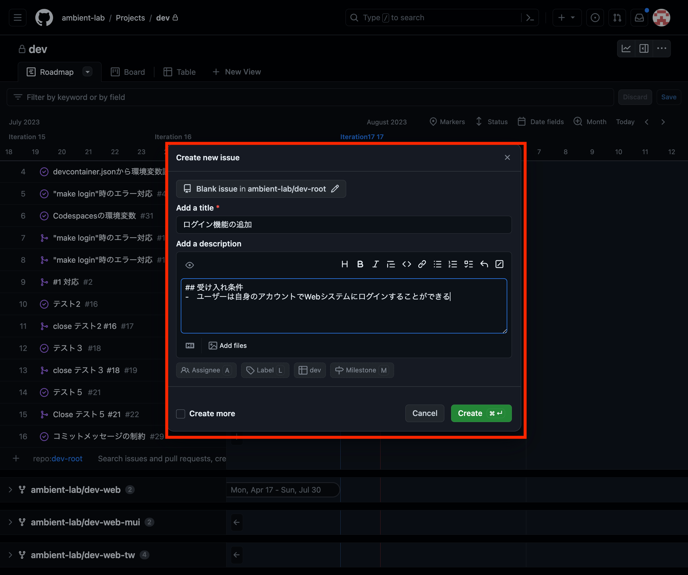
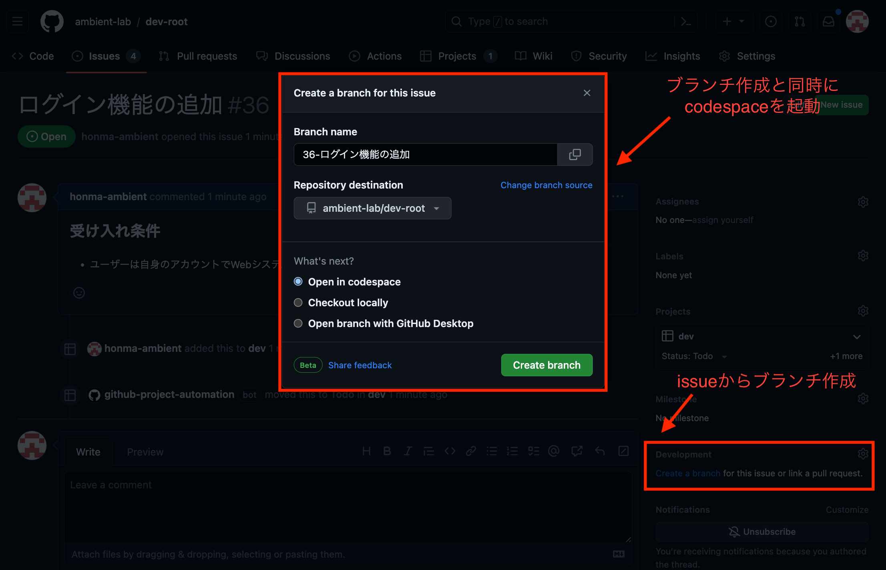
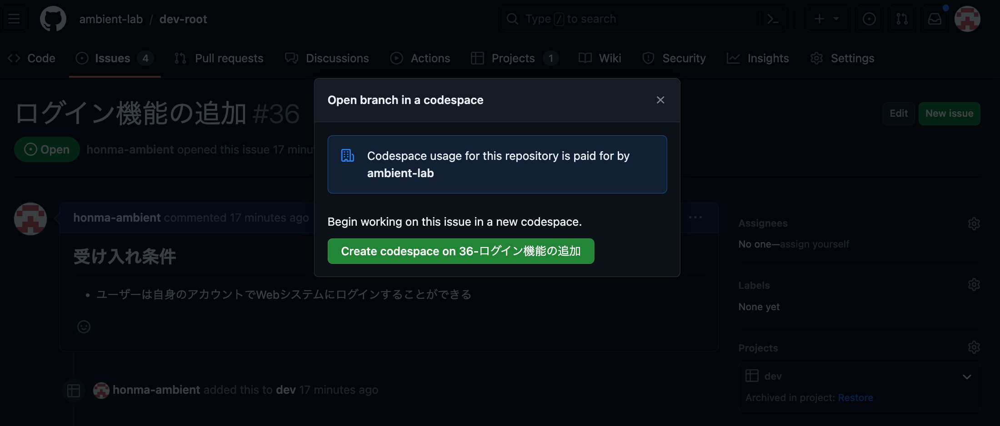
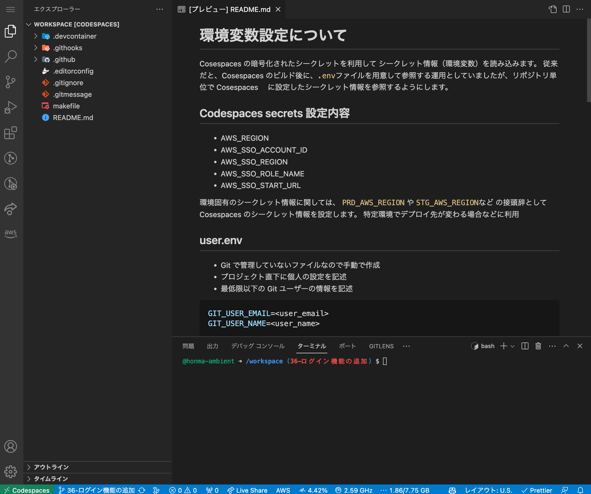

# dev-root について

GitHub で管理する 基本 OS の上流テンプレートリポジトリです。

# テンプレートリポジトリについて

- GitHub で管理するリポジトリのテンプレートです。
- Docker コンテナの構築ソースも含んでおり、プロジェクトソースを VSCode で開くことでプロジェクト毎に Docker コンテナが構築できるようにしています。(DevContainer)

## テンプレートリポジトリの種類

### Web テンプレート

Web システムの開発、デザインを重視する場合は TailwindCSS、管理画面などデザインを重視しない場合は MUI を利用

- React: フロントエンドフレームワーク
- Amplify: バックエンドフレームワーク
- MUI or TailwindCSS: UI コンポーネント

### アプリテンプレート

アプリシステムの開発、PoC 開発などデザインを重視しない場合は MUI を利用

- ReactNative: フロントエンドフレームワーク
- Expo: ReactNative の拡張ツール
- Amplify: バックエンドフレームワーク
- MUI: UI コンポーネント （※要件的に MUI が許容できる場合)

### インフラテンプレート

インフラや API、バッチなどの UI が伴わない開発

- CDK: IaC(Infrastructure as Code)
- SAM: サーバーレスアプリケーションを構築

### 構成内容

```bash
dev-root
├── dev-web
│   ├── dev-web-tw
│   │　　　　　　└── {案件}-web
│   └── dev-web-mui
│       └── dev-web-admin
├── dev-app
│　　　　　　└── {案件}-app
└── dev-infra
    └── {案件}-infra
```

| リポジトリ    | 利用種類                                      | 概要                                                                                         |
| ------------- | --------------------------------------------- | -------------------------------------------------------------------------------------------- |
| dev-root      | 上流。Public テンプレート                     | 基本 OS のテンプレート                                                                       |
| dev-web       | dev-root からの fork。Public テンプレート     | web システム のテンプレート                                                                  |
| dev-web-tw    | dev-web からの fork。Public テンプレート      | TaiwindCSS を利用する Web システムのテンプレート(デザイン性が必要なユーザー向けシステムなど) |
| dev-web-mui   | dev-web からの fork。Public テンプレート      | MUI を利用する Web システムのテンプレート(デザイン性が不要な PoC など)                       |
| dev-web-admin | dev-web-mui からの fork。Private テンプレート | Web 管理システムのテンプレート                                                               |
| dev-app       | dev-root からの fork。Private テンプレート    | Expo を利用するスマホアプリシステムのテンプレート                                            |
| dev-infra     | dev-root からの fork。Private テンプレート    | インフラ構築テンプレート                                                                     |

# 利用するシェルについて

デフォルトシェルは`zsh`を利用します。

# 環境変数設定について

Cosespaces の暗号化されたシークレットを利用して シークレット情報（環境変数）を読み込みます。

従来だと、Cosespaces のビルド後に、`.env`ファイルを用意して参照する運用としていましたが、リポジトリ単位で Cosespaces に設定したシークレット情報を参照するようにします。

## Codespaces secrets 設定内容

- AWS_REGION: `ap-northeast-1`
- AWS_SSO_ACCOUNT_ID: `xxxxxxxxxx`
- AWS_SSO_REGION: `ap-northeast-1`
- AWS_SSO_ROLE_NAME: `AdministratorAccess`
- AWS_SSO_START_URL: `https://xxxxxxxxxx.awsapps.com/start`

### AWS MFA パターン

MFA での認証をする場合にも、Codespaces のシークレット情報（環境変数）を設定して読み込みます。

- AWS_MFA_ASSUME_ROLE: `arn:aws:iam::<account_id>:role/<role＿name>`
- AWS_MFA_ACCESS_KEY_ID: `<access_key_id>`
- AWS_MFA_SECRET_ACCESS_KEY: `<secret_access_key>`
- AWS_MFA_DEVICE=arn:aws:iam:: `<account_id>:mfa/<user_name>`

## user.env

- Git で管理していないファイルなので手動で作成
- プロジェクト直下に個人の設定を記述
- 最低限以下の Git ユーザーの情報を記述

```toml
GIT_USER_EMAIL=<user_email>
GIT_USER_NAME=<user_name>
```

### AWS Credentials パターン

## user.env

```toml
AWS_SECRET_ACCESS_KEY=<access_key_id>
AWS_SECRET_KEY=<secret_access_key>
```

# GitHub のリポジトリ設定

### user.env

```toml
GITHUB_REMOTE_ORIGIN_URL=https://<user_name>:<access_token>@github.com/<organization_name>/<repository_name>.git
```

# 環境構築

## 前提説明

GitHub が VSCode の環境をホストして提供してくれるクラウドサービスの `Codespaces` を利用して環境構築を行います。

Codespaces を利用するメリットとして下記があります。

- オンラインの開発環境であり、自分でローカルに環境を用意する必要がない
- ブラウザからアクセスでき、いつでもどこでも開発可能
- セットアップが簡単
- セキュリティが高く自分のデバイス上で開発するよりも安全

### Codespaces 起動手順

1. Project から Issue を作成

- リポジトリごとに Project を用意するため Project で機能開発やバグ修正などを管理します。
- Project にて、Issue を起票し、下記の通りどういったことをするのかタイトルや説明を追記します。
  
  - `.github/ISSUE_TEMPLATE配下に`に issue 起票のテンプレートを用意してます。
    ```
    .github
      ├── dependabot.yml
      └── ISSUE_TEMPLATE
          ├── bug_report.md
          ├── custom.md
          └── feature_request.md
    ```
- Issue を起票後、issue からブランチを作成します。下記の通り feature ブランチと codespace の起動も行います。
  
  

2. Codespace 起動
   Codespace が起動すると下記の通りのようにホストされます。
   
3. AWS の認証コマンド

下記コマンドで認証

```bash
$ make login
```

# リポジトリのソースコード運用について

## リポジトリサイズの制限

https://docs.github.com/ja/repositories/working-with-files/managing-large-files/about-large-files-on-github#repository-size-limits

> リポジトリは小さく保ち、理想としては 1GB 未満、および 5GB 未満にすることを強くお勧めします。リポジトリが小さいほど、クローン作成が速く、操作やメンテナンスが簡単になります。

# Commit について

## 注意事項

**※`develop`や`main`ブランチへの直 Push は禁止します。(できないようにしています。)**
必ず作業ブランチを切ってプルリクエストを作って、コードレビュー後にマージする運用とします。

## コミットメッセージのルール

開発者同士でコミット履歴を見やすくするためメッセージに規則性を持たせるよう、commit メッセージテンプレートを使って commit します。

`.gitmessage`にメッセージのテンプレートを用意します。
例えば `：tada: <起票したissueの番号> ログイン機能を追加`のようにコミットメッセージをします。

## 優れた Git コミットメッセージの 7 つのルール

How to Write a Git Commit Message: https://cbea.ms/git-commit/

**1. 件名と本文を空行で区切る**
**2. 件名は 50 文字以内までにする**
**3. 件名は大文字で始める**
**4. 件名をピリオドや句読点で終わらせない**
**5. 件名は命令形な雰囲気で使用する**
**6. 本文を 72 文字ごとに改行する**
**7. 本文を使用して、何を、なぜ、どのようにしたかを記述する**

## コミットメッセージの自動チェック

git Hooks を使ってコミット時にコミットメッセージの自動チェックをしています。
下記のように、issue 番号を含めてないメッセージはコミットを取り消すように設定しています。

```bash
❯ git commit -m "テスト"
🪝 Running Git Hooks: commit-msg
 - issue番号の存在チェック: NG
================================================================
コミットメッセージにissue番号が含まれていません。

Example: #1234
================================================================

Git Hooks: commit-msg: NG

❯
```

# プルリクエストについて

- 作業ブランチから `develop`ブランチへプルリクエストを作成します。
- プルリクエストのマージについては最低 1 人以上のコードレビューがされないとマージできません。

## プルリクエストのマージ手法

GitHub にて用意されてるいずれかのプルリクエスト手法に基づいてコードレビュー者はマージできます。
開発者などで相談してマージ手法を決めて運用してください。

- マージコミット
  - 利点: 複数ブランチ・複数開発者のコミット変更履歴が残るため明確になる。
  - 欠点: 変更履歴が増えるので、リポジトリサイズが大きくなる
- スカッシュマージ
  - 利点: ブランチの変更履歴をコンパクトにしたい場合、有効なマージ手法
  - 欠点: 変更履歴が 1 つのコミットのため、変更の追跡やデバッグ時が困難
- リベースとマージ
  - 利点: マージ後の履歴をキレイに保てる、変更の適応順序や履歴の整理に適している手法
  - 欠点: リベース操作でブランチ履歴が書き換えられる。コンフリクトが起きると面倒。
