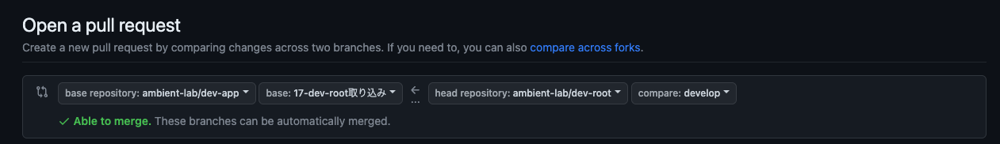

# fork 元の取り込みについて

fork 元のリポジトリに更新があった場合に取り込みの作業が必要になります

## 取り込みの手順

### プルリクからフォークのブランチを取り込む

- **はじめに「フォーク元の取り込み作業」のようなタイトルで issue を作成してください**
- **issue を作成後、作業ブランチを作成してください**

#### コンフリクトの確認

1. 取り込み用ブランチに向けて、fork 元の develop をマージするためのプルリクを作成する画面でコンフリクトの確認をします。

   - 「compare across forks」を押すことでリポジトリから指定できるようになります。
     

##### コンフリクトが無い場合

1. コンフリクトの確認を行った状態から、そのままプルリクエストを作成、マージします

2. 取り込み用ブランチから取り込みたいリポジトリの develop に向けてプルリクを作成し、マージします

##### コンフリクトがある場合

1. 取り込み用ブランチから codespaces を起動後、下記のコマンド群を実行してください

```
# リモートリポジトリの追加(されてなければ実行)
git remote add upstream https://github.com/ambient-lab/<フォーク元のリポジトリ名>.git

# リモートリポジトリの最新状態を取得
git fetch upstream

# リモートリポジトリの差分を表示
git diff upstream/develop

# リモートリポジトリの変更をマージ
git merge upstream/develop

# コンフリクトが発生した場合は修正

# 変更をステージング（UI上からもで可能)
git add .

# コミット（UI上からもで可能)
git commit -m "feature update"

# 作業ブランチをリモートリポジトリにプッシュ（UI上からもで可能)
git push origin <作業ブランチ>
```

2. 取り込み用ブランチから取り込みたいリポジトリの develop に向けてプルリクを作成し、マージします
