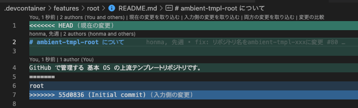
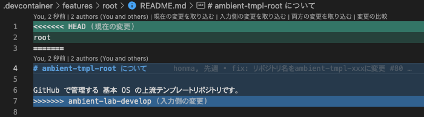

# テンプレートリポジトリの取り込みについて

テンプレートリポジトリは継続的なアップデートを行なっており、最新の状態を取り込むにはプロジェクトリポジトリ側で取り込み作業を行う必要はあります。

## 取り込み手順

1. Issue とブランチを作成する
2. 作成したブランチから取り込みスクリプト(`merge-parent-template-repository.sh`)を実行する
   1. rebase がコンフリクトした場合
      1. コンフリクトを解決する
      2. 取り込みスクリプトに`-s`のオプションを追加して再度実行する。`merge-parent-template-repository.sh -s`
   1. merge がコンフリクトした場合
      1. コンフリクトを解決する
      2. 作成したブランチで git push を実行する
3. PR を作成する
4. レビューを行う

## 取り込みスクリプトについて

`/workspace/.devcontainer/features/root`ディレクトリにある`merge-parent-template-repository.sh` を実行することで親となっているテンプレートリポジトリを取り込むコマンド群を実行します。

### 取り込みスクリプトで実行されるコマンド

#### フェイズ 1

1. git remote add upstream ${PARENT_REPOSITORY_URL}
2. git fetch upstream
3. git checkout -b ambient-lab-develop
4. git rebase upstream/develop

##### git rebase upstream/develop

merge の前に一度 rebase を行い、テンプレートリポジトリの内容を取り込んだブランチを作成しています。
rebase によりコミット毎の差分を解決します。
ここでは画像の「現在の変更(親テンプレートリポジトリの変更)」を取り込むことが主となります。

スクリプトに`-s`オプションを追加することでフェイズ 1 をスキップすることができます。
`merge-parent-template-repository.sh -s`
rebase でコンフリクトが発生した場合にこのオプションを使用します。

#### フェイズ 2

1. git checkout -
2. git merge --allow-unrelated-histories ambient-lab-develop
3. git push

##### git merge --allow-unrelated-histories ambient-lab-develop

こちらのコマンドで先ほど rebase を使って、テンプレートリポジトリの内容を取り込んだブランチと作業ブランチを merge します。
ここでテンプレートリポジトリの変更とプロジェクトリポジトリでのコンフリクトの解決を行います。
ここでは画像の「人力側の変更(親テンプレートリポジトリの変更を取り込んだブランチの変更)」を取り込むことが主となります。

### よくコンフリクトしてしまうファイル

- package.json
- yarn.lock
  基本的にモジュールの高いバージョンを指定しているものが正になるかと思いますが、プロジェクトの状況により異なります。
  関連箇所の動作確認をしっかり行うようお願いします。
